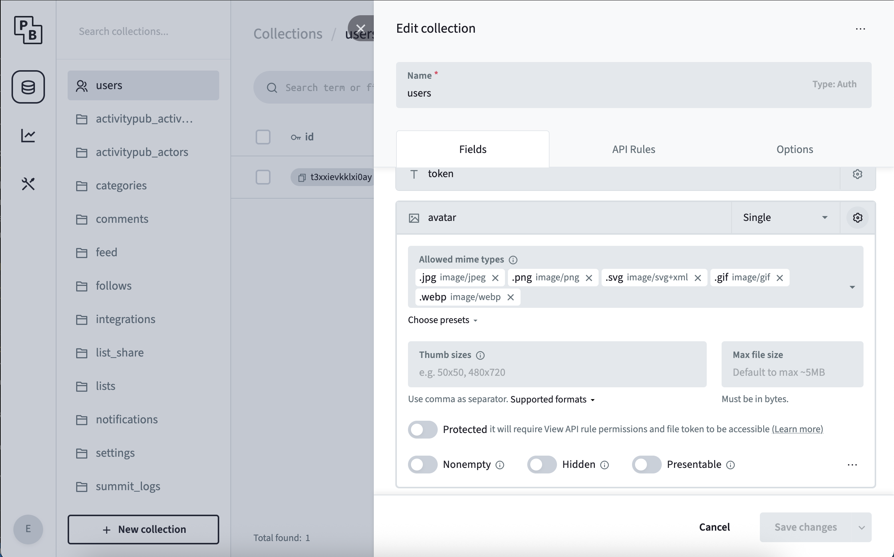

import { Aside } from '@astrojs/starlight/components';

<span class="-tracking-[0.075em]">wanderer</span> brings several mechanisms which allow limiting the maximum file size of content provided by users.
Pictures in the users profile, trail highlights and gpx tracks fall under this file size limit.

<Aside> 
As <span class="-tracking-[0.075em]">wanderer</span> runs parts of the logic in the users browser those limits can only be enforced, when trying to save a ressource.
This can lead to non-intuitive errors such as: editing and creating a trail, which is too large, is possible - saving it is not.
</Aside>

### Body Size Limit

The `BODY_SIZE_LIMIT` is a setting for the frontend, which fails requests if their payload is too large with an `500: Payload Too Large` error.
The standard value for this setting is `512kb`.

To adjust it, configure the `BODY_SIZE_LIMIT` [Environment Variable](../environment-configuration.md) to a value of you liking.
To disable this limit entirely you can set this variable to `Infinity`.

```sh
export BODY_SIZE_LIMIT=Infinity
```

<Aside type="tip">Read more about the limitations and configuration possibilities on the [SvelteKit Reference](https://svelte.dev/docs/kit/adapter-node#Environment-variables-BODY_SIZE_LIMIT).</Aside>

### Backend Filesize Verification

After the file passes the middleware, PocketBase does an additional verification on the file uploaded.
This verification includes a check for a maximum file size.

If this verification does not pass the request is terminated with a `500: error validation_file_size_limit`



To change this behaviour open the PocketBase admin panel and navigate to the designated table.
Click the gear icon at the top to open the table's settings and select the gear icon in the row you want to change.
Adjust the `Max File Size` property.

<Aside>
The maximum file size has to be specified in bytes. The theoretical maximum of a single file attachment is ~8GB as specified by the [pocketbase documentation](https://pocketbase.io/docs/files-handling/)
</Aside>
