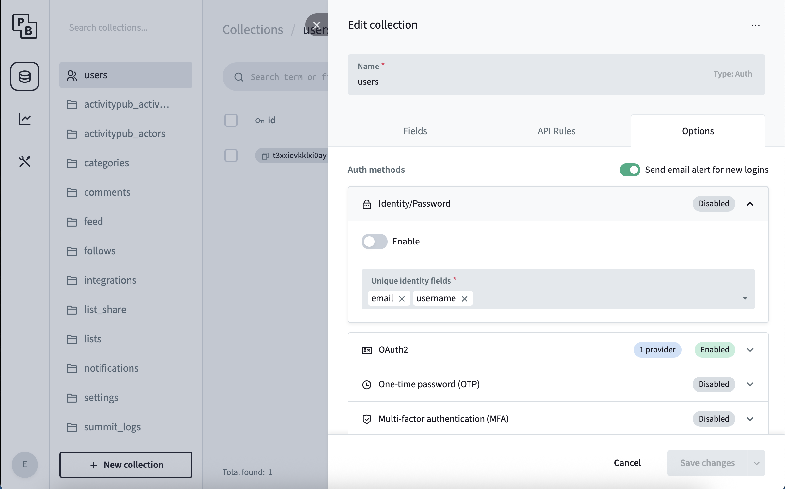

### Create an OAuth app

This step will vary wildly from provider to provider. Please refer to your provider's documentation for the specific steps.

No matter your provider, you will need a redirect URL. This redirect URL must have the following format: `$ORIGIN/login/redirect`. 
`$ORIGIN` refers to the `ORIGIN` environment variable that defines the public host at which your wanderer instance can be reached. 
So for the default installation, the redirect URL is `http://localhost:3000/login/redirect`.

In any case, once you have successfully created your OAuth app you will receive a Client ID and a Client Secret.

### Enable a provider in PocketBase

In the PocketBase admin panel navigate to the `users` table. Click the gear icon at the top to open the table's settings and navigate to `Options`.
In the tab `OAuth2`, add your provider and fill in the Client ID and Client Secret from the step before and save your changes.

### Disable password authentication

After enabling the neccessary OAuth2 providers for your application you may want to disable the standard local password authentication.

In the PocketBase admin panel navigate to the `users` table.
Click the gear icon at the top to open the table's settings and navigate to `Options`.

In the tab `Identity/Password`, toggle the switch and save the configuration.
