# wanderer plugins

This directory contains first-party WASM provider plugins.

Each plugin is a standalone Go/TinyGo module with:

- `plugin.json` as the source manifest
- `plugins/schema/plugin.schema.json` for editor completion and manifest help
- `go run github.com/open-wanderer/wanderer/plugins/sdk/cmd/manifestcheck` for normalized dist manifest output
- ignored `dist/<plugin-id>/plugin.json` and `dist/<plugin-id>/plugin.wasm` build output for runtime discovery

Build the dist bundles before running from a fresh checkout:

```sh
make plugins-build
```

The runtime loads plugins from direct child directories of `data/plugins`, for example `data/plugins/strava/plugin.json`. To build and install the bundled plugins into that gitignored local runtime directory, run:

```sh
make plugins-install-local
```

To rebuild a single plugin, install TinyGo and run:

```sh
cd plugins/strava
make build
```

Repeat for `hammerhead` and `komoot` as needed.

Release builds create plugin bundle archives in CI. The database Docker image does not include plugins; users install release bundles into `data/plugins`.

Plugin authors can reference the manifest schema from a source manifest:

```json
{
  "$schema": "../schema/plugin.schema.json",
  "manifestVersion": "1.0",
  "type": "trails"
}
```

## Runtime flows

This section maps the main runtime flows for debugging and maintenance. The diagrams use readable step names instead of every exact function name, but they point at the backend paths involved when the host invokes plugin capabilities, host requests, OAuth, and trail sending. The code these flows reference lives in the core backend under `db/` (PocketBase handlers, sync manager, host functions), not in this `plugins/` directory.

### Sync overview

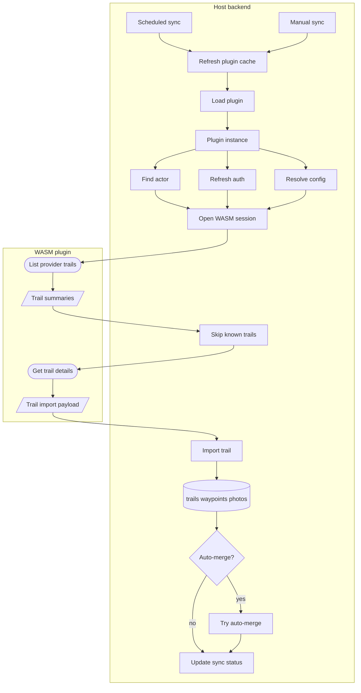

### User vs actor IDs

Plugin sync starts from `plugin_instances.user`, the local wanderer user that owns the plugin instance. The importer keeps that user ID for user-scoped host decisions, but writes imported record ownership through the user's local ActivityPub actor.

| ID | Used for |
| --- | --- |
| `plugin_instances.user` | Deduplicating provider imports for that user and applying user privacy defaults. |
| `activitypub_actors.id` found by `user` | Writing `trails.author`, `waypoints.author`, and `summit_logs.author`. |

### Host request boundary

Plugins cannot open provider connections themselves. They send a request spec to the host; the host resolves the connector, enforces policy, injects allowed auth, executes the HTTP request, and returns a bounded response. Host request failures after request decoding are returned to the plugin as `HostResponse.error` with the `provider_unavailable` code.

Host request bodies may be JSON, `application/x-www-form-urlencoded`, or
multipart, subject to the manifest upload limits and content-type allow-list.
Here "uploads" means plugin-to-provider request bodies, including login forms,
not only media/file uploads.
Redirect following is enabled by default; plugins can set `followRedirects` to
`false` to receive a 3xx response directly and handle provider login flows
step-by-step. `HostResponse.headerValues` preserves all values for headers such
as `Set-Cookie` and is the only response-header representation exposed to
plugins.

Plugins can emit host-visible diagnostics through the `wanderer:log` host
function. The payload is a JSON object with a strict `level` (`debug`, `info`,
`warn`, or `error`) and a non-empty `message`. The Go SDK exposes this as
`sdk.LogDebug`, `sdk.LogInfo`, `sdk.LogWarn`, and `sdk.LogError`.
Log messages are written to the host logs. Keep them short and never include
secrets, credentials, cookies, tokens, authorization codes, or full URLs with
query parameters.

```go
sdk.LogInfo("provider detail fetch took 420ms externalID=abc")
sdk.LogWarn("provider returned an optional photo without a URL")
```

Declare host functions used by a capability in `requiredHostFunctions`, for
example `["http_request", "log"]`.

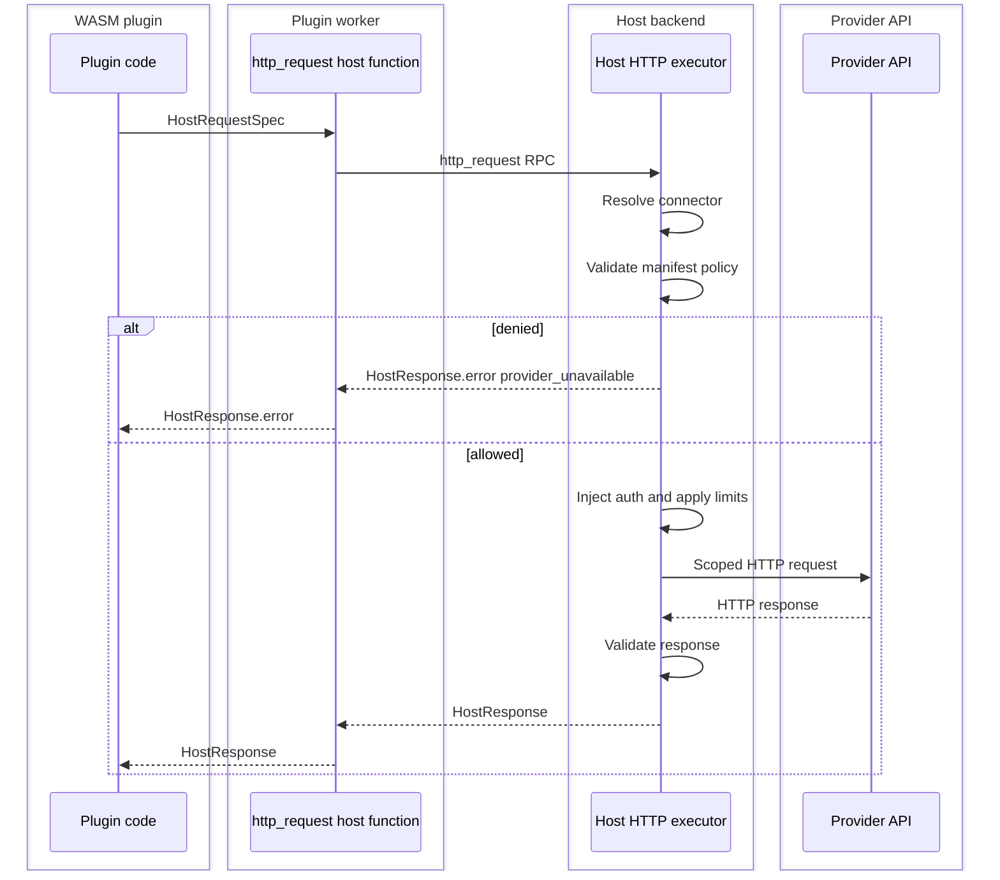

### Plugin discovery

Used when the backend refreshes the list of plugin bundles installed on disk and caches their manifests in PocketBase.

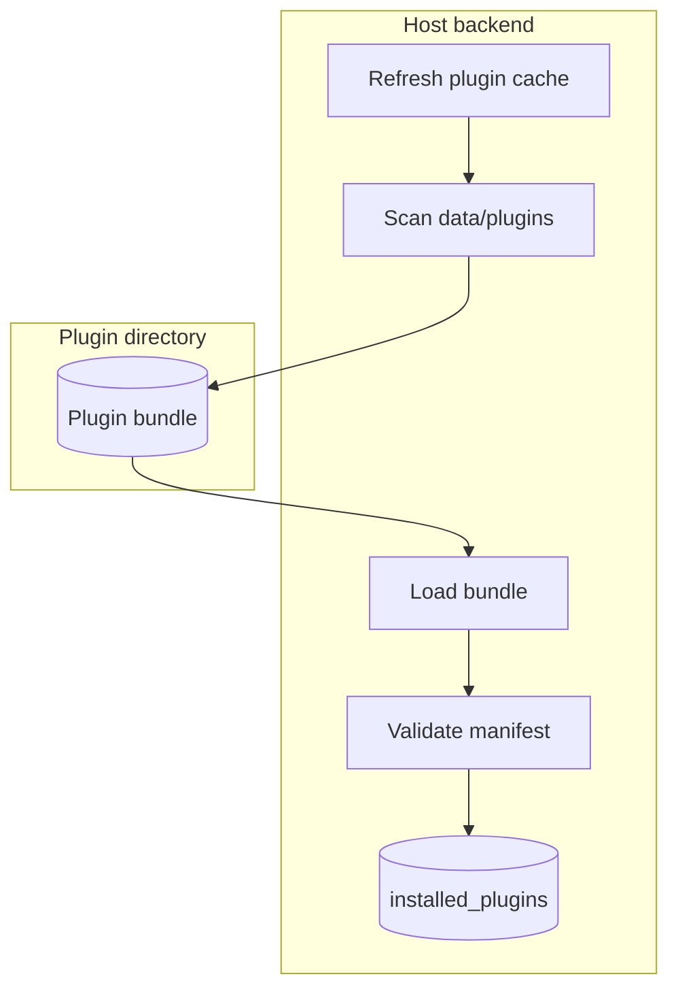

Manifest `configSchema` defines plugin-owned settings that are passed to plugin exports. Host-owned settings are documented by the host and are not passed to plugins. A manifest may only suggest host defaults via `hostConfig`; the current host fields are:

| Field | Purpose |
| --- | --- |
| `planned` | Enables `list_routes.v1` sync. |
| `completed` | Enables `list_activities.v1` sync. |
| `privacy` | Chooses provider visibility or local user privacy settings. |
| `merge.available` | Controls whether the UI offers auto-merge for this plugin. Defaults to `true`. |
| `merge.enabled` | Runs auto-merge after trail import. |
| `createSummitLogForCompleted` | Creates summit logs for completed imports. |
| `categoryMapping` | Maps `metadata.providerCategory` to local category IDs or names. |
| `connectors` | Provides host-owned base URL, TLS, private-network, and storage redirect settings for configured connectors. |

The settings UI lets users edit `categoryMapping` per plugin instance for trail import plugins.
Plugins may describe provider-owned category values for the settings UI with
`metadata.providerCategories`. This is display-only metadata; `categoryMapping`
keys still use the raw provider category values emitted as
`metadata.providerCategory`.

Trail import plugins should keep provider-specific category values in `metadata.providerCategory`. They may also provide provider summary metrics in `metadata.distance`, `metadata.elevationGain`, `metadata.elevationLoss`, and `metadata.duration`; the host uses those positive values instead of GPX-derived summary metrics and falls back to GPX when a value is missing. Plugins may provide an intended start coordinate in `metadata.providerStart` as `{ "lat": 47.123, "lon": 8.456 }`; the host uses it only when it is close enough to the imported GPX track to be plausible.

Photo descriptors may be returned either on the imported trail or on individual waypoints. The host downloads those media files and stores them on the corresponding PocketBase records.

### List plugins

Used by the settings UI to show locally available plugins, their metadata, icons, capabilities, and current availability status.

Plugins may provide optional UI metadata through `manifest.metadata`:

| Field | Purpose |
| --- | --- |
| `displayName` | Human-facing provider name shown in the UI. Falls back to manifest `name`. |
| `displayNames` | Optional localized provider names keyed by locale, e.g. `de` or `de-CH`. Falls back to `displayName` and `name`. |
| `descriptions` | Optional localized plugin descriptions keyed by locale. Falls back to manifest `description`. |
| `providerCategories` | Optional metadata for provider-owned category values. The settings UI uses `providerCategories.*.labels` for localized category mapping labels. |
| `icons.light` | Light-theme icon path inside the plugin bundle. |
| `icons.dark` | Dark-theme icon path inside the plugin bundle. |

Config schema fields may also localize plugin-owned UI text. The simple
`label` and `description` strings remain valid fallbacks; optional `labels`
and `descriptions` maps override them for matching locales. Select options can
use `label` and `labels` in the same way. Fields with `"required": true` are
validated in the settings modal. Fields with `"hidden": true` are not rendered
in the settings modal, but their saved values are preserved and still passed to
plugin exports.

Locale lookup uses the exact locale first, then the language, then `en`, then
the simple fallback string.

```json
{
  "description": "Imports public hike suggestions from Schweizer Wanderwege.",
  "metadata": {
    "displayName": "Schweizer Wanderwege",
    "displayNames": {
      "de": "Schweizer Wanderwege",
      "en": "Swiss Hiking Trails"
    },
    "descriptions": {
      "de": "Importiert öffentliche Wandervorschläge der Schweizer Wanderwege.",
      "en": "Imports public hike suggestions from Swiss Hiking Trails."
    }
  },
  "configSchema": [
    {
      "key": "maxPhotos",
      "type": "text",
      "label": "Max photos",
      "labels": {
        "de": "Max. Fotos",
        "en": "Max photos"
      },
      "description": "Maximum photos to import per hike. Use 0 for none or -1 for all.",
      "descriptions": {
        "de": "Maximale Anzahl Fotos pro Wanderung. 0 importiert keine Fotos, -1 alle.",
        "en": "Maximum photos to import per hike. Use 0 for none or -1 for all."
      },
      "required": true
    }
  ]
}
```

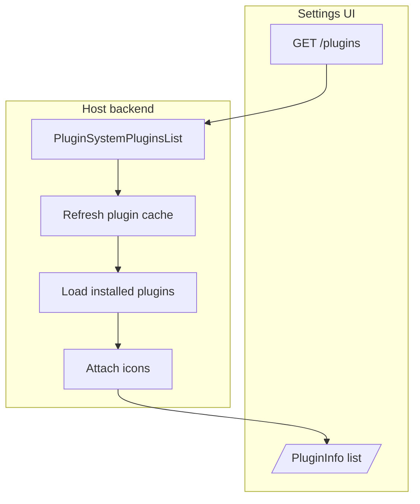

### Save plugin instance

Used whenever a user creates or updates their personal plugin configuration. This path is where auth values are encrypted and default status is assigned.

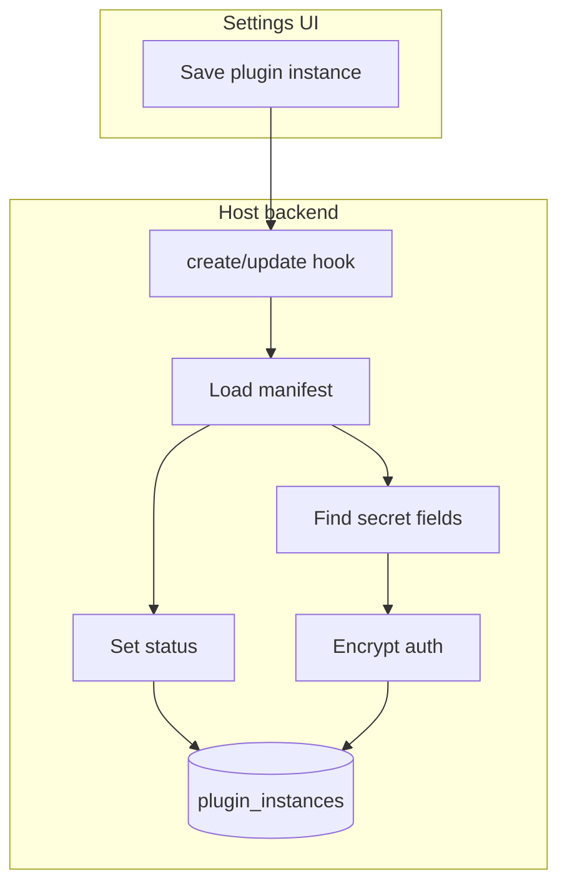

### OAuth connection

Used when the UI connects a plugin instance to an OAuth provider. Start and callback are separate HTTP endpoints, but together they form one browser redirect flow. The host exchanges the authorization code and stores tokens encrypted on the plugin instance.

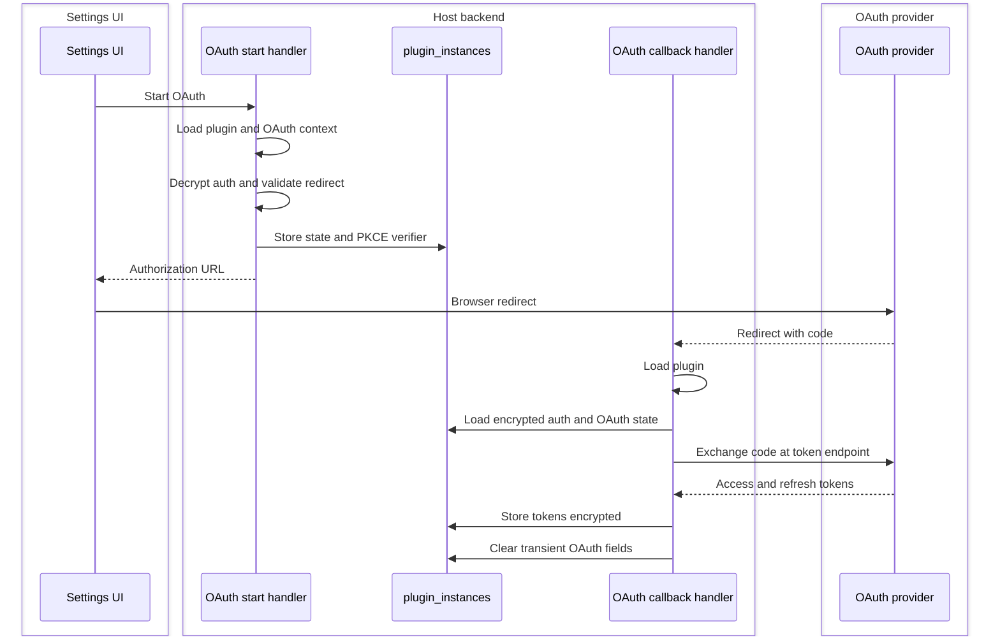

### Cron sync

Used by the scheduled background sync. It refreshes installed plugin metadata and syncs enabled plugin instances.

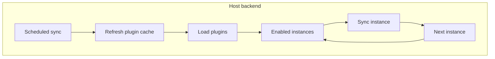

### Sync retry handling

Used when a previous sync failed with a retry delay. Cron skips the instance until `retry_not_before` is reached. A successful sync clears `retry_not_before`.

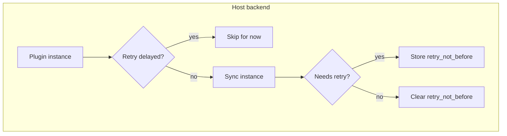

### Sync one instance

Used to prepare one user/plugin instance for sync: actor lookup, runtime selection, auth decryption, OAuth refresh, and capability dispatch.

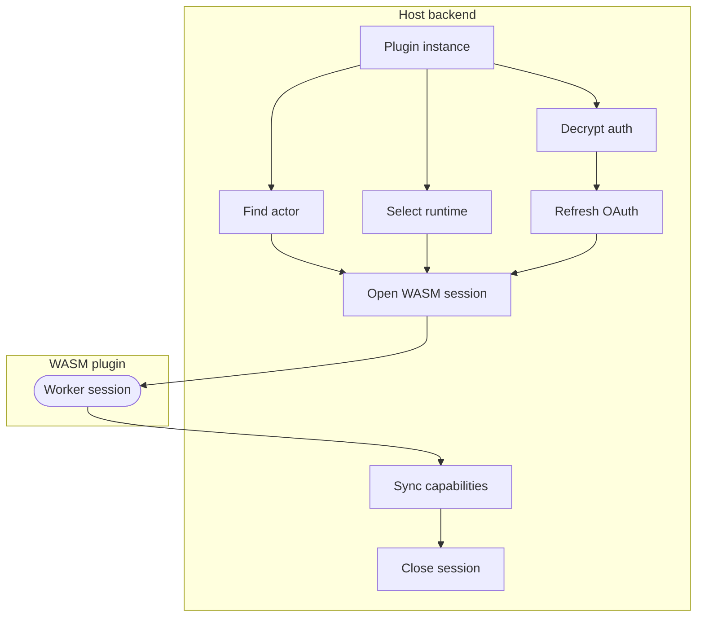

### Capabilities

Every plugin capability is declared as a manifest capability. The runtime flow depends on what the capability does: importing trails uses a list/detail pair, while sending a trail asks the plugin for a provider request plan.

#### Capability: Trail import

Used for one import capability pair such as `list_routes.v1` with `get_route_detail.v1`, or `list_activities.v1` with `get_activity_detail.v1`. This is where provider summaries become imported trails.

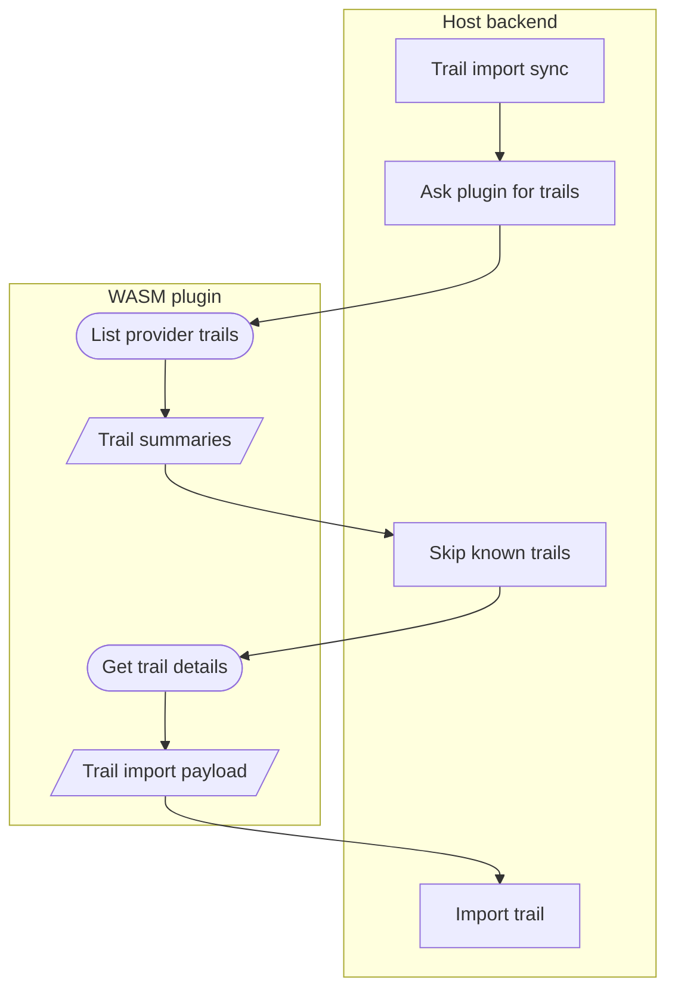

#### Capability: Send trail

Used when a user sends an existing wanderer trail to an external provider.

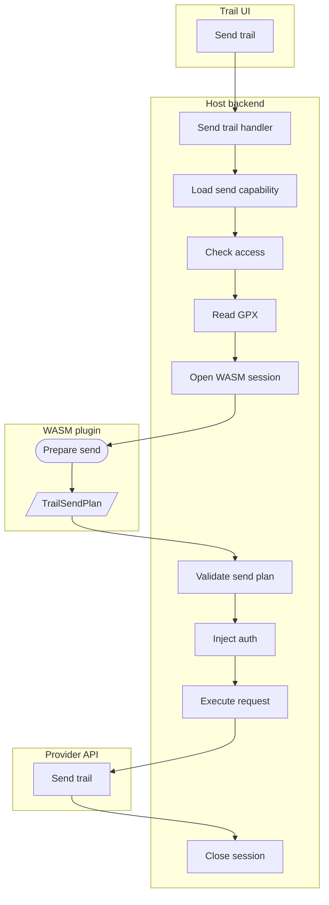
